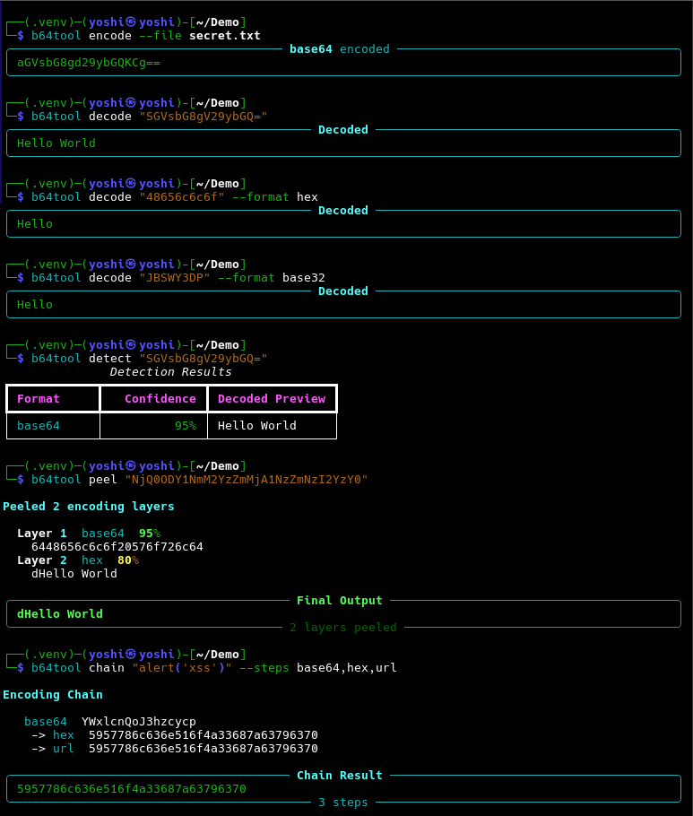

<!-- ©AngelaMos | 2026 -->
<!-- DEMO.md -->

<div align="center">

```ruby
██████╗  ██████╗ ██╗  ██╗████████╗ ██████╗  ██████╗ ██╗
██╔══██╗██╔════╝ ██║  ██║╚══██╔══╝██╔═══██╗██╔═══██╗██║
██████╔╝██║  ███╗███████║   ██║   ██║   ██║██║   ██║██║
██╔══██╗██║   ██║╚════██║   ██║   ██║   ██║██║   ██║██║
██████╔╝╚██████╔╝     ██║   ██║   ╚██████╔╝╚██████╔╝███████╗
╚═════╝  ╚═════╝      ╚═╝   ╚═╝    ╚═════╝  ╚═════╝ ╚══════╝
```

**Demo & Preview**

<br>

<a href="https://pypi.org/project/b64tool/">
  
</a>

<br>

```ruby
uv tool install b64tool
```

<br>

[Encoding](#encoding) · [Decoding, Detection & Layer Peeling](#decoding-detection--layer-peeling)

</div>

---

### Encoding

Base64, Hex, Base32, URL encoding with piped input support


---

### Decoding, Detection & Layer Peeling

File encoding, multi-format decoding, auto-detection with confidence scoring, recursive layer stripping, and multi-step encoding chains


